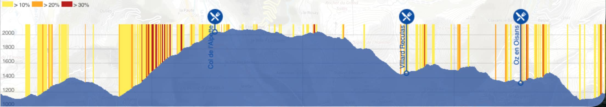
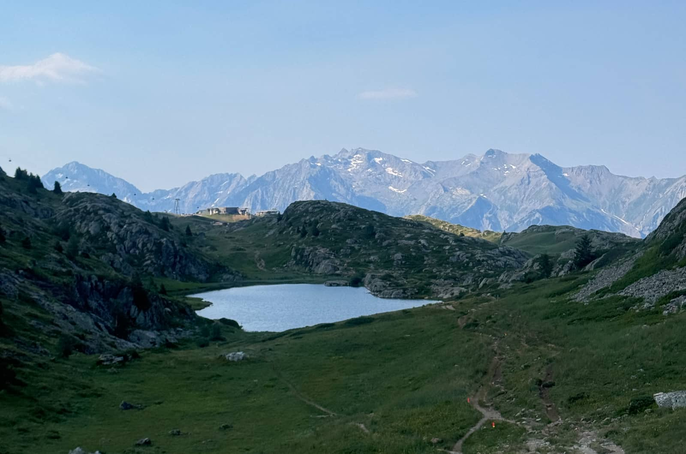
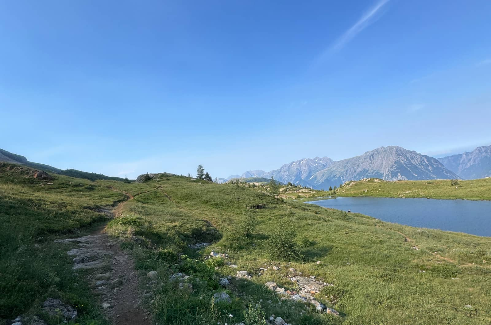

- [Maršruta apraksts](#maršruta-apraksts)
- [Kāpēc šīs sacensības?](#kāpēc-šīs-sacensības)
- [Plānošana un nokļūšana](#plānošana-un-nokļūšana)
- [Sacensību pieredze](#sacensību-pieredze)
- [Izmaksas](#izmaksas)
- [Kopsavilkums](#kopsavilkums)

## Maršruta apraksts
<a href="https://oisanstrailtour.fr/en/home/" target="_blank" rel="noopener noreferrer">Oisans Trail Tour</a> sacensības norisinājās Francijas Dauphiné Alpu reģionā ar startu un finišu ciematā <a href="https://maps.app.goo.gl/HjgPT662sHfcQVBx7" target="_blank" rel="noopener noreferrer">Vaujany</a>, netālu no leģendārā Tour de France kalna un populārā slēpošanas kūrorta Alpe d'Huez. Es piedalījos Trail Tour (39km, 2027am) distancē, bet bija arī Ultra Tour (89km, 4867am) un pāris īsākas distances.

Starts bija 8:00 no rīta un trase iesākās ar 8km apli apkārt ciematiņam, pēc kura sekoja distances galvenais izaicinājums - 900m kāpums līdz gandrīz 2100m vjl. ar vidējo slīpumu 15% un vairākiem posmiem virs 30%.

Skatoties uz karti, šāds viens dominējošs kāpums viegli ļauj par zemu novērtēt atlikušos 7, no kuriem 4 ir masīvāki nekā jebkurš kalns Latvijā. Uz šī grābekļa arī es veiksmīgi uzkāpu.

Trasē bija 3 kontrolpunkti un visos bija ļoti plašs ēdienu un dzērienu klāsts. Sākumā pēdējie 2 likās pārāk tuvu viens otram (pēdējais vien 4km pirms finiša), tomēr praksē tajā trases daļā temperatūra jau bija diezgan uzkāpusi un iespēju uzpildīt dzeramos izmantoju un novērtēju visos kontrolpunktos.

Segums visa maršruta garumā bija viegli skrienams. Pārsvarā grantenes vai kompaktas takas. Ciematu apkaimēs asfaltēti ceļi un tikai atsevišķās vietās bija īsi, akmeņaini posmi. Visu kopā pievarēt vīriešu un sieviešu kopvērtējuma uzvarētājiem prasīja vien 3h30min un 4h21min.

Skatu ziņā man visvairāk patika trases daļa virs 1800m vjl. un pirmais 8km aplītis ap ciematiņiem pirms garākā kāpuma. Liela daļa pārējās trases bija ieskausta kokos, kas arī ir forši un ļoti palīdz tikt galā ar karstumu, bet šādos pasākumos man personīgi prasās kaut ko jaunu. Mežs ir ļoti pazīstama un pieejama vide mājās.

## Kāpēc šīs sacensības?
Lai gan parasti man patīk vadīties pēc sajūtām un iedvesmas, šoreiz sacensību izvēle bija tīri stratēģiska. Gada sākumā, kad sezonas plāns jau bija gatavs, šīs sacensības nebija daļa no tā. Mērķis bija būvēt sezonu ap Latvijas sacensībām, lai būtu pēc iespējas vairāk mēģinājumu dabūt labu reitingu kvalifikācijai izlasē. Izvēlējos Vilkaču maratonu un Stirnu Buka finālu kā savas top prioritātes sacensības un Gauja Trail by UTMB 50k distanci pieredzei garākā skrējienā. Šāds plāns labi sakrita ar līdzšinējo pieredzi, ka vispatīkamāk ieplānot svarīgākās sacensības ir pavasarī un rudenī, lai vasaru atstātu brīvāku citiem dzīves notikumiem. Paralēli sporta dzīvei šogad vēlējos iegādāties un iekārtot dzīvokli, tāpēc ietaupīt uz ceļošanu būtu ļoti noderējis.

Tad marta beigās tika publicētie jaunie izlases kritēriji, kas padarīja Stirnu Buka posmus pilnīgi nederīgus kvalifikācijai. Arī Gauja Trail bez papildu starta ārzemēs nekam nederētu, jo trasē ir par maz augstummetru. Vienīgās sacensības, kas atbilda jaunajam normatīvam, bija Vilkaču maratons, bet mans potenciālais sniegums tajā bija neskaidrs, jo pusi no pavasara nīkuļoju ar pēdas traumu. Vajadzēja jaunu plānu.

Braukt uz augstiem kalniem vai skriet pa tehniskām trasēm būtu bijis episki, bet man vajadzēja izvēlēties sacensības ar pēc iespējas mazāk nezināmajiem, lai palielinātu iespējas uzstādīt labu sniegumu nevis tikai “gūt pieredzi”. Uzstādītie priekšnosacījumi izvēlei bija:

- Viegla nokļūšana
- Apļveida maršruts
- Augstākais punkts vēlams zem 2000m
- Kāpumi lielākoties pirmajā pusē
- ITRA Mountain Level vismaz 5
- ITRA Marathon distances kategorija
- Vēlams ne pārāk dārgs ceļojums

Sākumā fokusējos uz iespējām Polijā, bet katrā pasākumā kaut kas līdz galam nesakrita vai arī vairs nebija iespējams reģistrēties. Beigās nolēmu apvienot skrējienu ar nedaudz garāku atvaļinājumu Francijā, lai uz vietas paskatītos Tour de France posmus. Šis viss kopā palīdzēja reducēt izvēles iespējas uz kādām 2 sacensībām.

Lai gan 'ne pārāk dārgs ceļojums' nosacījumu beigās īsti neizdevās izpildīt, aukstā ziema mani bija par daudz nokāvusi un jau 2 gadus nekur nebiju ceļojis. Pavasara vidū sāku just, ka man vajag izdarīt kaut ko priekš sevis prieka nevis aprēķina pēc. Šis ceļojums tad arī bija tas, un beigās tā noteikti bija pareizā izvēle.

## Plānošana un nokļūšana
Uz Franciju izlidoju dienu pirms starta no Rīgas uz Lionu ar pārsēšanos Varšavā. Turpat no Lionas lidostas sekoja komfortabls 1h vilciena brauciens līdz Grenoblei, kur 10min gājienā no stacijas biju norezervējis nakstmītni. Protams, lidojumi ar pārsēšanos vienmēr ir suboptimāli, bet vasaras vidū mierīgi iztiku ar 1 mugursomu un 1 maisiņu skriešanas botām. Viss salonā un poļu aviokompānija LOT pie nekā nepiekasījās.

No Grenobles līdz starta ciematiņam Vaujany bija 1h brauciens ar auto, un šeit man lieti noderēja vietējā telefona aplikācija *Getaround*, kas ļauj iznomāt automašīnas no vietējiem. Neviens nebija jāsatiek, ne uz ko nebija jāgaida. Nebija pat jāmaksā depozīts. Reģistrējies, norezervē, ar bluetooth atver durvis, safočē pāris bildes un brauc. Viss caur aplikāciju un tikai nedaudz lielāks čakars kā pie mums ar *Bolt Drive*. Manīju, ka arī Francijā ir *Bolt Drive*, bet šobrīd vēl tikai dažās pilsētās. Iespējams, ka tuvā nākotnē arī tā būs opcija. Lai vai kā, savlaicīgi jau biju visu rezervējis, 12 pa dienu izgāju no dzīvokļa Rīgā un īsi pēc 21 jau biju gultā Grenoblē ar sapirktu pārtiku brokastīm un noparkotu mašīnu rīta braucienam vien dažu minūšu attālumā. Sacensību rītā ceļi tukši un brauciens bez pārsteigumiem. Ierodoties ciematiņā 1h pirms starta, stāvvietas atrašana nebija problēma.

Galvenais šķērslis bija tas, ka pat sacensību nolikums bija tikai franču valodā. Paviršāk šim pieejot, varētu palaist garām, ka Francijā vajag reģistrēties pie vieglatlētikas federācijas, lai iegūtu <a href="https://pps.athle.fr" target="_blank" rel="noopener noreferrer">atļauju</a> gada garumā piedalīties skriešanas sacensībās. Šī gan ir vairāk Francijas nevis šo sacensību problēma, kas ar visiem mūsdienu tulkošanas rīkiem ir diezgan viegli risināma. Nolikuma PDF tulkoju un visus jautājumus par to uzdevu *Gemini*, kamēr visu pārējo tulkoju ar veco labo *Google Translate*.

Kopumā viss noritēja pēc plāna un procesā ļoti novērtēju visas tehnoloģijas, kas sniedz iespēju tik detalizēti sagatavoties pilnībā attālināti. Kā jau minēju, vēlējos, lai ceļošana un plānošana pirmajās ārzemju sacensībās sagādā pēc iespējas mazāku stresu, lai var vairāk fokusēties uz pašu skriešanu. Tas arī tīri labi izdevās.

## Sacensību pieredze
Tie, kas seko Stravā, drošvien manīja, ka man izdevās iegūt 3. vietu kopvērtējumā. Šoreiz gan veiksme nedaudz man uzsmaidīja, jo konkurence bija krietni mazāka kā gadu iepriekš. Es stipri šaubos, ka par šo sniegumu saņemšu labāku ITRA reitingu kā par Vilkaču maratonu. Mans minējums šobrīd ir, ka šoreiz tikai knapi izpildīšu izlases kritērija minimālo 720. Salīdzinājumam, par Vilkaču maratona uzvaru saņēmu reitingu 772.

Patiesībā <a href="https://davispazars.lv/blogs/2026-06-22/vilkacu-maratons-2026/" target="_blank" rel="noopener noreferrer">Vilkaču maratona negaidītais sniegums</a> beigās ļoti atviegloja šo skrējienu un ļāva fokusēties tīri uz pieredzes gūšanu. Tas man ļāva pārāk nepārdzīvot, ka garāko kāpumu un arī noskrējienu nedaudz pārķēru un otrajā pusē nācās pāriet izdzīvošanas režīmā. Patiesībā pirmajā reizē labāk tā un nākamreiz skaidri zināt, kur ir robeža, nevis izdarīt visu pareizi vai par maz un savā ziņā palikt neziņā. Tas arī ļāva trases augstākajā posmā nedaudz piebremzēt, pabaudīt skatus un pat uzņemt pāris fotogrāfijas. Līdz šim sacensībās to nekad nebiju darījis.

Pēc šīm sacensībām man nostiprinājās pārliecība, ka biežāk jābrauc uz ārzemēm, jo Latvijas īsie kalniņi nespēj tā patiesi sagatavot muskuļus garu noskrējienu noturībai. Vēl arī secināju, ka nākamreiz labprāt pamēģinātu garāku skrējienu. Tādi 40km tomēr paiet diezgan ātri un intensitāte vēl ir gana augsta, ka daudzus skatus vai mirkļus tā īsti nemaz nesanāk piefiksēt. Es vēlos sacensties, bet arī vēlos vairāk sajust apkārtējo vidi, un šobrīd šķiet, ka 60-80km distances tam varētu būt labs zelta vidusceļš. 

## Izmaksas
Kopējās summas ziņā ceļojums beigās nesanāca pārāk lēts. Tomēr no *price/performance* perspektīvas tūrisma sezonas pīķī Francijā, esmu ļoti apmierināts ar to, ko saņēmu par samaksāto. Ja brauktu kompānijā, būtu vēl izdevīgāk, jo viesnīcas numuriņā varēja palikt vēl viens cilvēks un arī mašīnas izmaksas varētu dalīt:

| Pozīcija | Summa, eiro | Komentārs |
|----------|-------------|-----------|
| Aviobiļetes         |  352           | Rīga - Varšava - Liona  un atpakaļ         |
| Vilciens         |        40     | Turp un atpakaļ uz lidostu         |
| PPS         |          5   |  Atļauja piedalīties sacensībās         |
| Naktsmītne         |    100         | 2x naktis 2x cilvēkiem ar gaisa kondicionieri        |
| Auto noma         |        62     |           |
| Benzīns         |            15 |           |
| Dalības maksa         |        68     |           |
| Kopā         |           642  |           |

Teorētiski sacensību organizatori piedāvāja *carsharing* platformu un bija pieejamas arī lētākas naktsmītnes. Tomēr no labāka snieguma perspektīvas es prioritizēju komfortu un paredzamību. Kamēr vien finanses ļauj, liekas muļķīgi upurēt kaut 1% no treniņu procesā ieguldītā dažu desmitu eiro dēļ.

## Kopsavilkums
Plānošanas ziņā šis bija ļoti izdevies brauciens. Viss noritēja gludi gan pa ceļam uz pasākumu, gan pasākuma laikā. Nebija jāceļas uz lidojumu naktī vai vēlu jāierodas un digitālā pasaule deva iespēja visu saplānot priekšlaicīgi.

No trases un ainavu skatapunkta skrējējiem no Latvijas drošvien ir izdevīgāki piedāvājumi. Ļoti patika trases augstākā daļa, bet beigās sapratu, ka man prasītos tehniskāku trasi un gribētu mazāk mežus, jo we have mežs at home. Ja būtu braucis tikai uz sacensībām, iespējams, būtu palikusi nedaudz mazuma piegarša.

Tomēr beigu galā es esmu ļoti apmierināts ar izvēli, jo skrējiens bija tikai kā daļa no nedēļu gara atvaļinājuma reģionā, lai dzīvē paskatītos Tour de France posmus. Paliku Grenoblē, kas ir gana liela pilsēta ierastajām ērtībām, kā arī uz visām debespusēm no tās ir lieliskas pārgājienu un taku skriešanas opcijas vien dažu kilometru attālumā. Nemaz nerunājot par riteņbraukšanas iespējām. Šādā konfigurācijā pasākumu varētu ieteikt.

Gala vērtējums: 7/10
